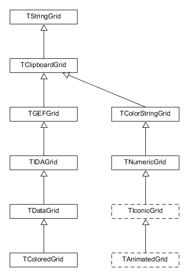
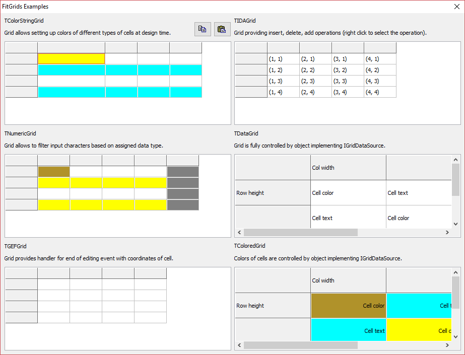

# fitgrids
Package provides a few grid components for Delphi & Lazarus.

## TClipboardGrid
The grid provides copying and pasting operation with the clipboard.

## TGEFGrid
The grid controls exit from cell editing. At the moment of exit event of type TGridEditingFinished is generated.

## TIDAGrid
The grid implements operations of inserting, adding, deleting rows and colums as well as pasting/copying text from/in the ClipBooard (IDA is acronym of Insert, Delete, Add).

## TDataGrid
The grid which can call methods of class - data source and exchange data with objects of that class (class must implement special interface). 

## TColoredGrid, TColorStringGrid
Theses grids allow setting up colors of different types of cells at design time.

## TNumericGrid
The grid allows to contol input of numbers.



## Class diagram

## Test application



These grids are used in following projects  
[MotifMASTER](http://motifmaster.sourceforge.net/)  
[Fit](http://fiteasily.townbreath.com/fit/downloads.html)  

